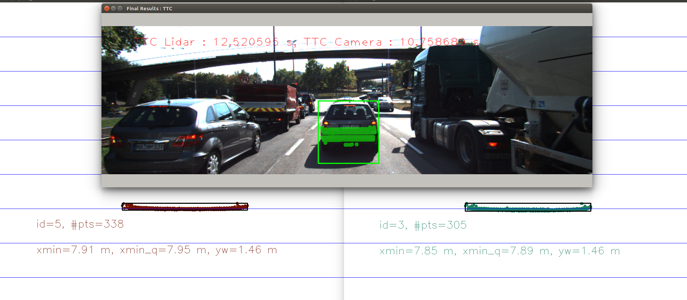
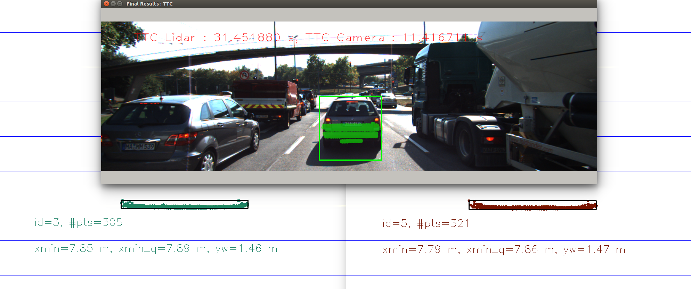
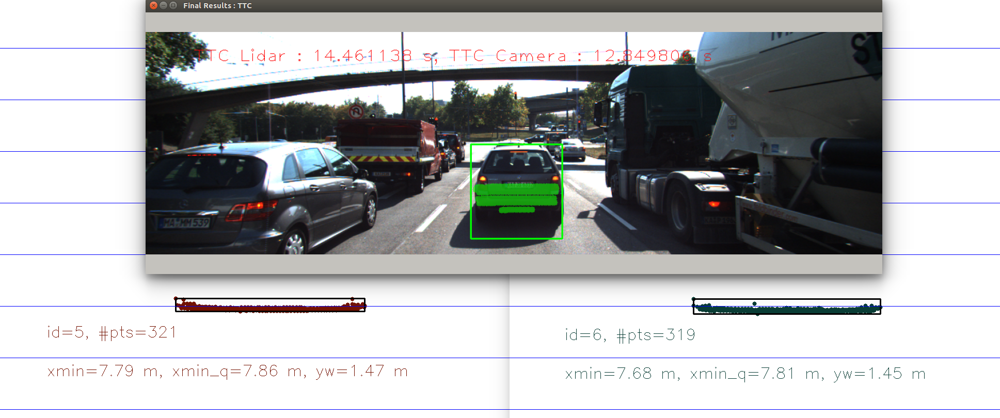
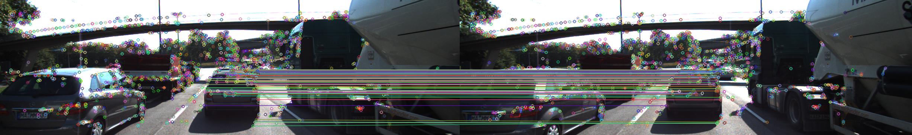

# 3D Object Tracking

> **Note**: This project was originally submitted as part of Udacity's Sensor Fusion Nanodegree in 2020. It has been published on GitHub with improvements and refinements.


**Tags**: `3d-object-tracking` `time-to-collision` `TTC` `sensor-fusion` `lidar` `camera` `YOLO` `object-detection` `keypoint-matching` `autonomous-vehicles` `collision-avoidance` `computer-vision` `deep-learning` `KITTI-dataset`


## Project Overview

This is the final project of the camera course in Udacity's Sensor Fusion Nanodegree. I implemented a complete 3D object tracking system that fuses camera and Lidar data to calculate Time-to-Collision (TTC) for vehicles ahead, which is a critical component for autonomous vehicle safety systems.

### My Contributions

I developed the core algorithms for 3D object tracking and TTC estimation:

* **3D Object Matching**: Implemented a robust method to match 3D objects across consecutive frames using keypoint correspondences
* **Lidar-based TTC**: Developed TTC computation using Lidar measurements with outlier filtering using quantile-based distance estimation
* **Camera-based TTC**: Implemented TTC calculation based on keypoint correspondences using distance ratio analysis with median filtering
* **Keypoint Association**: Created an algorithm to associate keypoint matches with bounding boxes, including distance-based filtering
* **Sensor Fusion Analysis**: Evaluated and compared different detector/descriptor combinations for TTC estimation reliability
* **Performance Optimization**: Identified issues with both Lidar and camera-based TTC estimates and proposed solutions

## Project Structure

```
3d-object-tracker/
├── CMakeLists.txt              # Build configuration
├── README.md                   # This file
├── dat/                        # Data and models
│   └── yolo/                   # YOLO neural network files
│       ├── coco.names          # Class names
│       ├── yolov3-tiny.cfg     # YOLOv3-tiny configuration
│       ├── yolov3-tiny.weights # YOLOv3-tiny weights
│       ├── yolov3.cfg          # YOLOv3 configuration
│       └── yolov3.weights      # YOLOv3 weights
├── images/                     # Dataset
│   └── KITTI/                  # KITTI dataset
│       └── 2011_09_26/
│           ├── image_02/       # Camera images
│           └── velodyne_points/# Lidar point clouds
└── src/                        # Source code
    ├── camFusion_Student.cpp   # Camera-Lidar fusion implementation
    ├── camFusion.hpp           # Header file
    ├── dataStructures.h        # Data structure definitions
    ├── FinalProject_Camera.cpp # Main application
    ├── lidarData.cpp           # Lidar processing
    ├── lidarData.hpp           # Lidar header
    ├── matching2D_Student.cpp  # Feature matching implementation
    ├── matching2D.hpp          # Matching header
    ├── objectDetection2D.cpp   # YOLO-based object detection
    └── objectDetection2D.hpp   # Object detection header
```

## Technical Implementation

### 1. Match 3D Objects Across Frames

I implemented the `matchBoundingBoxes` method that matches 3D objects between consecutive frames:

**Algorithm**:
- Construct a score matrix tracking keypoint correspondence frequencies for each box-pair
- Iterate through all matched keypoints
- Increment scores for box-pairs that contain both points of a match
- Select the box with the highest score as the best match

```cpp
void matchBoundingBoxes(std::vector<cv::DMatch> &matches, 
                       std::map<int, int> &bbBestMatches, 
                       DataFrame &prevFrame, DataFrame &currFrame)
```

### 2. Compute Lidar-based TTC

I developed a robust TTC computation using Lidar measurements:

**Key Features**:
- Filter Lidar points to ego lane only
- Use 20th percentile (quantile-based) distance to handle outliers
- Apply formula: `TTC = d1 * Δt / (d0 - d1)`

**Why Quantile-based?** Using the minimum distance directly is sensitive to outliers. The quantile approach provides more stable distance estimation.

### 3. Associate Keypoint Correspondences with Bounding Boxes

I implemented `clusterKptMatchesWithROI` to associate keypoints with bounding boxes:

**Algorithm**:
- Calculate mean distance for all matches within the bounding box
- Filter matches using a threshold (1.3× mean distance)
- Associate filtered keypoints and matches with the bounding box

This filtering removes outliers and improves TTC accuracy.

### 4. Compute Camera-based TTC

I implemented camera-based TTC using keypoint correspondences:

**Algorithm**:
- Compute distance ratios between all keypoint pairs
- Use median distance ratio (robust to outliers)
- Apply formula: `TTC = -Δt / (1 - medianDistRatio)`

**Why Median?** The median is more robust than the mean when dealing with outlier distance ratios.

## Performance Evaluation

### Lidar TTC Analysis

I identified cases where Lidar TTC estimates show unusual behavior:

**Observation**: In frames 2-4, TTC jumped from 12s → 31s → 14s despite the ego vehicle moving slowly near a red light.

**Root Cause**: Small movement distances (0.03m between frames) cause large fluctuations in the denominator `(d0 - d1)`, leading to unstable TTC estimates.





### Camera TTC Analysis

I evaluated multiple detector/descriptor combinations for camera-based TTC:

**Selected Combinations** (based on mid-term project analysis):

 

**Selected Combinations** (based on mid-term project analysis):

|Sr. No. | Detector + Descriptor |
|:---:|:---:|
|1 | FAST + ORB |
|2 | FAST + BRIEF |
|3 | SHITOMASI + BRIEF |

**TTC Comparison Results** (18 frames):

|Frame | Lidar TTC (s) | FAST+ORB (s) | FAST+BRIEF (s) | SHITOMASI+BRIEF (s) |
|:---:|:---:|:---:|:---:|:---:|
|1 |13.3|11.0 |10.8 | 14.7|
|2 | 12.5|10.8 |11.0 | 14.0|
|3 | 31.5|11.4 |14.2 | 9.7|
|4 |14.5 |12.8 |14.4 | 15.0|
|5 |10.2 | 17.8|20.0 | 12.8|
|6 |14.0 |13.0 |13.3 | 13.3|
|7 | 11.4|11.6 |12.2 | 15.3|
|8 |14.8 |11.2 |12.8 | 12.1|
|9 |13.2 |12.1 |12.6 | 11.9|
|10 |15.2 |13.3 |13.5 | 12.6|
|11 |11.9 |13.8 |13.7 | 11.9|
|12 |9.6 |10.9 |11.0 | 11.8|
|13 |8.9 |12.0 |12.4 | 11.7|
|14 |9.5 |10.7 |11.2 | 11.4|
|15 |7.7 |11.2 |11.9 | 12.2|
|16 |9.2 |11.2 |11.8 | 8.2|
|17 |11.8 |7.9 |7.9 | 11.1|
|18 |10.4 |10.6 |11.6 | 8.4|

**Key Findings**:
- Camera-based TTC is generally less stable than Lidar-based TTC
- Variations occur due to matched points on the ground or other vehicles
- These points violate the constant-distance assumption required for accurate TTC
- Median filtering helps but doesn't eliminate all outliers




## Skills Demonstrated

- **Sensor Fusion**: Combining Lidar and camera data for robust object tracking
- **Computer Vision**: Keypoint detection, matching, and tracking
- **Deep Learning**: YOLO-based object detection
- **C++ Programming**: Advanced algorithms and data structures
- **3D Geometry**: Point cloud processing and 3D-2D projection
- **Statistical Methods**: Outlier filtering with quantile and median approaches
- **Performance Analysis**: Systematic evaluation of different algorithms

## Dependencies for Running Locally
* cmake >= 2.8
  * All OSes: [click here for installation instructions](https://cmake.org/install/)
* make >= 4.1 (Linux, Mac), 3.81 (Windows)
  * Linux: make is installed by default on most Linux distros
  * Mac: [install Xcode command line tools to get make](https://developer.apple.com/xcode/features/)
  * Windows: [Click here for installation instructions](http://gnuwin32.sourceforge.net/packages/make.htm)
* Git LFS
  * Weight files are handled using [LFS](https://git-lfs.github.com/)
* OpenCV >= 4.1
  * This must be compiled from source using the `-D OPENCV_ENABLE_NONFREE=ON` cmake flag for testing the SIFT and SURF detectors.
  * The OpenCV 4.1.0 source code can be found [here](https://github.com/opencv/opencv/tree/4.1.0)
* gcc/g++ >= 5.4
  * Linux: gcc / g++ is installed by default on most Linux distros
  * Mac: same deal as make - [install Xcode command line tools](https://developer.apple.com/xcode/features/)
  * Windows: recommend using [MinGW](http://www.mingw.org/)

## Basic Build Instructions

1. Clone this repo.
2. Make a build directory in the top level project directory: `mkdir build && cd build`
3. Compile: `cmake .. && make`
4. Run it: `./3D_object_tracking`.

## Acknowledgments

This project was completed as part of Udacity's Sensor Fusion Engineer Nanodegree program. The KITTI dataset was used for testing and validation.